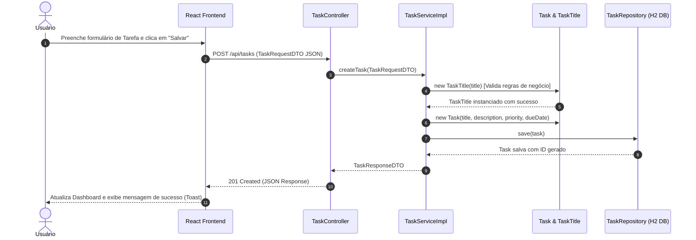

# Documentação Arquitetural - Primeira Entrega (TP1)
**Projeto de Bloco: Construção de um Monólito Simples com Spring Boot**

---

## 1. Visão Geral da Solução

A solução desenvolvida para a primeira entrega (TP1) consiste em uma aplicação monolítica simples, escalável e sustentável, composta por:
- **Back-End**: API REST construída com **Spring Boot 3** e **Java 25**, aplicando os princípios do **Domain-Driven Design (DDD)**, arquitetura em camadas e os princípios **SOLID**.
- **Front-End**: Interface de Usuário moderna e reativa criada em **React** (Vite), integrada via serviços HTTP/REST.
- **Banco de Dados**: H2 Database em memória para facilidade de ambiente de desenvolvimento e testes integrados.

---

## 2. Modelagem de Domínio (DDD - Domain-Driven Design)

A aplicação foi organizada em torno do **Bounded Context** `TaskManagement` (Gestão de Tarefas):

### Entidades e Value Objects
- **`Task` (Entidade JPA / Domínio)**: Representa uma tarefa com identidade própria (`id`), ciclo de vida (`createdAt`, `updatedAt`, `dueDate`) e comportamentos encapsulados (`updateStatus`, `updateDetails`).
- **`TaskTitle` (Value Object)**: Objeto de valor imutável que garante a integridade e validações do título (tamanho mínimo, não nulo, sem espaços extras).
- **`Priority` (Enum)**: Níveis de severidade (`LOW`, `MEDIUM`, `HIGH`, `URGENT`).
- **`TaskStatus` (Enum)**: Estados do ciclo de vida da tarefa (`PENDING`, `IN_PROGRESS`, `COMPLETED`, `CANCELLED`).

---

## 3. Aplicação dos Princípios SOLID

1. **SRP (Single Responsibility Principle)**:
   - `TaskController`: Responsável estritamente pela recepção de requisições HTTP e retorno das respostas REST.
   - `TaskServiceImpl`: Responsável pelas regras de negócio e coordenação de dados.
   - `TaskRepository`: Responsável exclusivamente pela persistência de dados.
2. **OCP (Open/Closed Principle)**:
   - Inclusão do `GlobalExceptionHandler` (`@RestControllerAdvice`) que permite adicionar novos tipos de tratamento de erro sem alterar os Controllers existentes.
3. **LSP (Liskov Substitution Principle)**:
   - Uso de interfaces Spring Data JPA e substituição transparente por implementações geradas pelo framework.
4. **ISP (Interface Segregation Principle)**:
   - Contratos de serviços e DTOs segregados por finalidade (`TaskRequestDTO`, `TaskResponseDTO`, `DashboardMetricsDTO`).
5. **DIP (Dependency Inversion Principle)**:
   - `TaskController` depende da abstração `TaskService` e não de uma classe concreta. A injeção de dependência é gerenciada pela autoconfiguração do Spring Boot.

---

## 4. Diagrama de Componentes (Mermaid)

```mermaid
graph TD
    subgraph Frontend ["Front-End (React + Vite)"]
        UI["React SPA Components"]
        API_CLIENT["api.js (Fetch HTTP Client)"]
        UI --> API_CLIENT
    end

    subgraph Backend ["Back-End Monólito (Spring Boot 3)"]
        subgraph WebLayer ["Camada de Controle (Web)"]
            CTRL["TaskController (@RestController)"]
            EX_HANDLER["GlobalExceptionHandler (@RestControllerAdvice)"]
        end

        subgraph ServiceLayer ["Camada de Serviço (Aplicação)"]
            SERVICE_INTF["TaskService (Interface)"]
            SERVICE_IMPL["TaskServiceImpl (@Service)"]
            SERVICE_INTF <|.. SERVICE_IMPL
        end

        subgraph DomainLayer ["Camada de Domínio (DDD)"]
            ENTITY["Task (Entity)"]
            VO["TaskTitle (Value Object)"]
            ENUMS["Priority / TaskStatus (Enums)"]
            ENTITY --- VO
            ENTITY --- ENUMS
        end

        subgraph RepoLayer ["Camada de Persistência"]
            REPO["TaskRepository (Spring Data JPA)"]
        end
    end

    subgraph Database ["Banco de Dados"]
        H2[("H2 In-Memory DB")]
    end

    API_CLIENT -->|HTTP / JSON REST| CTRL
    CTRL --> SERVICE_INTF
    SERVICE_IMPL --> REPO
    SERVICE_IMPL --> ENTITY
    REPO -->|Spring Data JPA| H2
```

---

## 5. Diagrama de Sequência - Criação e Listagem de Tarefas (Mermaid)



---

## 6. Instruções de Execução

### Pré-requisitos
- JDK 17+ (Java 25 testado e suportado)
- Node.js v18+ e npm

### 1. Executando o Back-End (Spring Boot)
Navegue até a pasta do backend e execute o Gradle Wrapper:
```bash
cd TP1/backend
.\gradlew.bat bootRun
```
A API estará acessível em `http://localhost:8080/api/tasks`.
O console H2 In-Memory estará disponível em `http://localhost:8080/h2-console`.

### 2. Executando o Front-End (React)
Em outro terminal, navegue até a pasta do frontend:
```bash
cd TP1/frontend
npm install
npm run dev
```
Abra o navegador no endereço indicado (ex: `http://localhost:5173`).

---

## 7. Instruções para Emissão do PDF (nome_sobrenome_PB_TP1.PDF)
1. Abra o arquivo `TP1/docs/RELATORIO_TP1.html` no seu navegador (Chrome/Edge).
2. Clique no botão **"Imprimir / Salvar como PDF"** no topo da página.
3. Altere o destino de impressão para **"Salvar como PDF"**.
4. Defina o nome do arquivo seguindo a regra exigida: `SeuNome_SeuSobrenome_PB_TP1.PDF` (Exemplo: `manoel_egidio_PB_TP1.PDF`).
